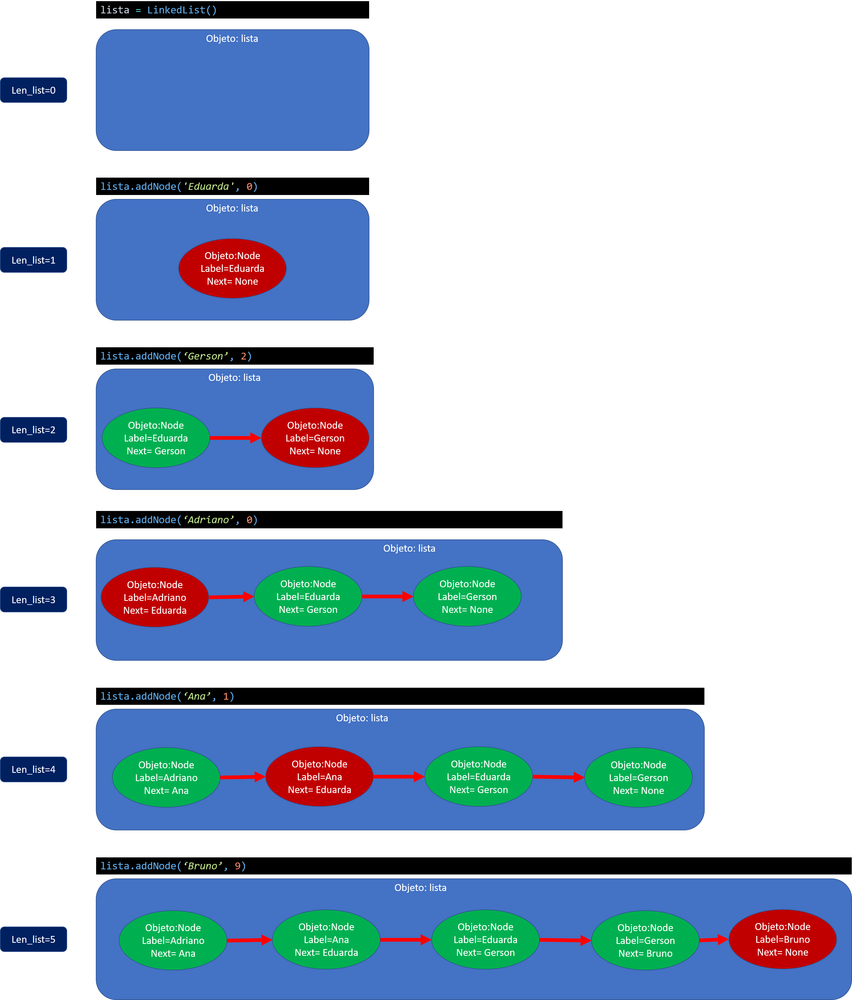

<!-- @format -->

# Questão 1

> Quando um programa é compilado, o binário executável fica armazenado em (A). Quando o usuário executa uma chamada para esse executável, o binário é transferido para (B). Durante sua execução, existem três espaços reservados: (C).

# Questão 2

Diferencie Stack e Heap

-   Escopo de variáveis
    **Stack**: local. Variáveis são acessíveis apenas pela função responsável pela stack.
    **Heap**: global. Variáveis são acessadas por qualquer função, já que seu dado possui uma referência para o endereço de memória.
-   Alocação estática e dinâmica
    **Stack**: alocação estática.
    **Heap**: alocação dinâmica.
-   Gerenciamento de memória
    **Stack**: não fragmenta a memória.
    **Heap**: gera fragmentação da memória.

# Questão 3

-   Tipos de dados primitivos
    Estrutura de dados que não podem ser decompostas em estruturas menores
-   Tipos de dados estruturados
    Ao contrário dos dados primitivos, essa estrutura pode ser decomposta em estruturas menores
-   Tipos de dados abstratos
    Conjunto de dados e operações que podem ser aplicadas a uma estrutura de dados, ou seja, TAD é uma estrutura de dado do tipo (valores, operações)

# Questão 4

Através do uso de TAD o programador estará utilizando os conceitos DRY e encapsulamento, simplificando assim o processo de criação de um sistema complexo, pois o TAD irá funcionar como uma caixa preta em que o programador não precisará se preocupar com o que acontecesse internamente e sim com as operações e comportamentos definidos pelo TAD.

Além disso, modificações internas do TAD não irão afetar os processos que usam as operações do TAD.

# Questão 5

1. Vetores são naturalmente estáticos já que temos que definir seu tipo e tamanho. No entanto, existem maneiras de declarar vetores como ponteiros e assim transformando-os em vetores dinâmicos.

2. Com vetores a busca é mais rápida já que podemos ir direto na posição que se encontra o dado, já em lista encadeada temos que percorrer toda a lista ate encontrar o dado desejado. Inserção de um dado em uma lista encadeada é sempre mais rápida que em um vetor, tirando o caso em que inserimos um dado ao final do vetor.

3. A fragmentação de memoria é quando um dado não ocupa todo o espaço de memória alocado para ele. As listas encadeadas tratam de maneira mais eficiente esse problema do que vetores, porque as listas alocam memoria de acordo com o dado que aparece diferente dos vetores que já alocam toda a memoria no inicio sem saber exatamente o tamanho do dado que virá, acabando, na maioria dos casos, superestimando o tamanho de memória alocada.

# Questão 6

a.exemplo

```python
class DateStruct:
	def __init__(self,day, month, year):
		self.day = day
		self.month = month
		self.year = year
```

b.banco

```python
import conta
class Cliente:
	def __init__(self,nome:str, cpf:int, telefone:int,endereco:str,cep:int,agencia:int,n_conta:int):
		self.nome=nome
		self.cpf=cpf
		self.telefone=telefone
		self.endereco=endereco
		self.cep=cep
		self.conta=conta(agencia,n_conta)
```

c.Mybook

```python
import list_seguidores,mural
class Usuario:
	def __init__(self,id:int, email:str, senha:str):
		self.id=id
		self.email=email
		self.senha=senha
		self.list_seguidores=list_seguidores()
		self.mural=mural()
```

# Questão 7

```python
class Ingrediente:
	def __init__(self,nome:str, quantidade:float, medida:str):
		self.nome=nome
		self.quantidade=quantidade
		self.medida=medida
```

-   Metodo: change_nome

    Entrada: novo_nome(str)
    Saida: novo_nome(str)
    Objetivo: método recebe novo_nome e muda o valor self.nome para novo_nome, retornando o novo valor. Caso não seja possível, não ocorre a mudança de nome e retorna uma mensagem de erro.

-   Metodo: change_quantidade

    Entrada: novo_quantidade(float)
    Saida: novo_quantidade(float)
    Objetivo: método recebe novo_quantidade e muda self.quantidade para o novo_quantidade, retornando o novo valor. Caso o novo_quantidade seja menor que zero, não ocorre a mudança de valor e retorna uma mensagem de erro.

-   Metodo: change_medida

    Entrada: novo_medida(str)
    Saida: novo_medida(str)
    Objetivo: método recebe novo_medida e muda self.medida para o novo_medida, retornando o novo valor. Caso o novo_medida não esteja dentro da lista_medida, não ocorre a mudança de medida e retorna uma mensagem de erro.

-   Metodo: lista medida

    Entrada:
    Saida: lista_medidas(list)
    Objetivo: método retorna todos os possíveis nomes de medidas.

-   Metodo: fator_conversao

    Entrada: medida_old(str),medida_new(str)
    Saida: fator(float)
    Objetivo: método recebe medida_old,medida_new e retorna o valor de conversão da medida_old para o medida_new. Caso qualquer uma das entradas não esteja na lista de medidas, retornar mensagem de erro.

-   Metodo: adiciona quantidade

    Entrada: qtd(float),medida(str)
    Saida: novo_qtd(str)
    Objetivo: método recebe um valor, positivo ou negativo, para a quantidade e uma medida. Caso a medida seja diferente da self.medida ele converte a quantidade multiplicando pelo fator do método fator_conversao(self.medida,medida) e o resultado será adicionado ao valor self.quantidade retornando o resultado dessa soma concatenado ao self.medida.
    Caso o valor de entrada seja negativo e a soma com o valor original de negativo, ou a medida não esteja dentro da lista de medidas retorna uma mensagem de erro e não adiciona o valor de entrada ao valor da quantidade original.

# Questão 8

8.1.1. Criar uma estrutura de lista encadeada
8.1.2. 2 classes: no e linkedlist
8.1.3. A classe linkedlist possui objetos gerados da classe no.
8.1.4. Os dados ficam armazenados de maneira dinâmica dentro de objetos no.
8.2.1. O objeto linkedlist é criado, depois utilizamos o método addNode para criar nós que irão guardar informação, esses nós serão ligados uns aos outros como uma espécie de fila, onde cada nó só saberá da existência do próximo nó, se houver. A adição de nós pode ocorrer de 3 maneiras:

- nó no inicio da fila (index=0)
Novo nó se torna o primeiro nó
- nó no meio da fila (0<index<len_lista)
Novo nó vai para a posição do index dado
- nó no fim da fila (index>=len_lista)
Novo nó vai para o fim da fila



# Questão 9

# Questão 10
